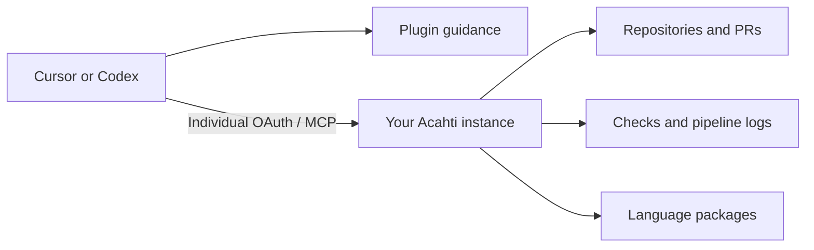

# Acahti Plugin

**Connect your coding agent to your Acahti instance.**

[](LICENSE)

[Cursor package](cursor/README.md) · [Codex package](codex/README.md) · [Acahti](https://github.com/lpythu/acahti) · [Workspace distribution](docs/workspace-distribution.md)

Two small, host-specific packages connect Cursor and Codex to Acahti's Git,
pull requests, pipelines, commit checks and package workflow. Product operations
come from your instance's MCP server. The plugin supplies connection guidance and
rules; it is not a separate Git host or an agent runtime.



## Install

| Host | Package | Connection |
|---|---|---|
| Cursor | `cursor/` via the repository marketplace | Set `ACAHTI_URL`, then complete MCP OAuth |
| Codex | `codex/` via the repository marketplace | Configure `/mcp` in native MCP settings and authenticate |

Follow the linked package instructions for your host. Reuse an existing connection;
do not register the same server twice. Workspace distributions can bundle a chosen
endpoint without bundling members' credentials.

## Verify

Ask your agent to check the Acahti connection through MCP, call `whoami`, confirm
the intended account and instance, and fetch `inbox`. Opening the website or
completing a browser redirect alone does not verify MCP tool availability.

For commits and pushes **targeting Acahti**, the rules verify the member's Git
identity. Other Git destinations keep their existing identity and workflow.
Reminder hooks do not enforce a Git-level block and do not change Git configuration.
Never paste tokens or passwords into an agent conversation.

## Develop

```bash
python3 -m pip install -r tests/requirements.txt
python3 -m unittest discover -s tests -v
```

Keep the Cursor rules and Codex skill aligned. Instance behavior is discovered
through `whoami.skill_url`; do not bake a customer's credentials or endpoint into
the generic packages. Organization-specific release configuration belongs in the
[distribution guide](docs/workspace-distribution.md).

Apache-2.0. See [LICENSE](LICENSE). Use the repository's private vulnerability
reporting for security issues.
